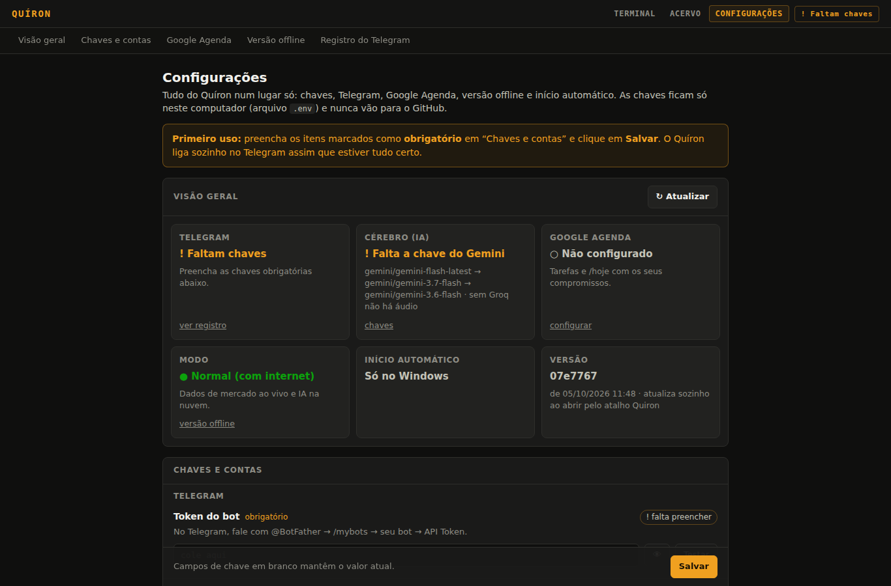
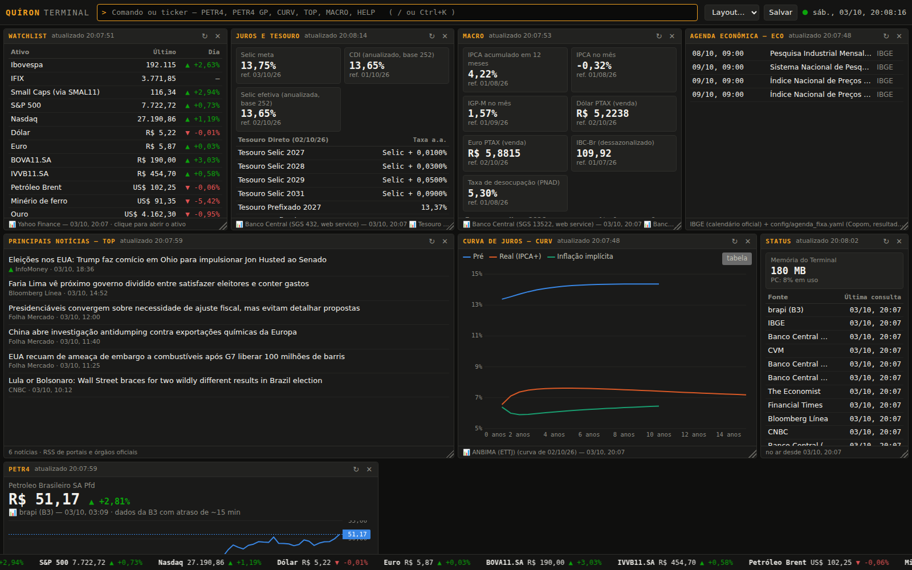

# Kit de arranque — Quíron, o parceiro de análise do assessor
> Sistema pessoal e de propriedade de Rickson Messias. Independente da EQI.
*(Nome definido: Quíron.)*

## O que é
Um agente de nível especialista (repertório CFP, CFA, CAIA, FRM, CGA/CGE, CNPI) com duas faces:
o **agente no Telegram** e o **Quíron Terminal**, uma tela estilo terminal profissional de mercado.

## A estratégia: ferramentas primeiro, agente depois
Você começa **hoje, no seu PC, de graça**. Cada capacidade do Quíron é construída como uma ferramenta (MCP)
que você já usa conversando com o Claude Code. O agente 24h do Telegram (Hermes, Claude ou bot próprio)
e o servidor são escolhidos só na Fase 5, depois de você testar tudo. Nada é refeito.

## Arquivos
| Arquivo | Para que serve |
|---|---|
| `docs/00-ROTEIRO.md` | **Comece aqui:** 19 fases, checklist inicial, itens numerados, testes de aceite e prompts |
| `CLAUDE.md` | Manual que o Claude Code lê sozinho |
| `docs/01-FUNCIONALIDADES.md` | Tudo o que o Quíron faz |
| `docs/02-ARQUITETURA.md` | Ferramentas MCP, Terminal, onde roda cada coisa |
| `docs/03-HOSPEDAGEM.md` | Opções de servidor 24h (decisão na Fase 5) |
| `docs/05-MATERIAIS-GRATUITOS.md` | Materiais gratuitos para a Academia |
| `docs/06-TERMINAL.md` | Especificação do Quíron Terminal |
| `docs/07-DECISAO-RUNTIME.md` | Hermes × Claude × bot próprio (decisão na Fase 5) |
| `config/*.yaml` | Persona, trilha de certificações, watchlist, fontes de notícias |
| `.env.example` | Modelo das chaves (todas gratuitas) |

## As fases
**No seu PC:** 0. Fundação · 1. Biblioteca e Mentor · 2. Dados de mercado · 3. Notícias e redes · 4. Terminal v1
**No servidor 24h:** 5. Agente no Telegram · 6. Academia · 7. Motor de análise · 8. Carteiras e risco · 9. Planejamento CFP ·
10. Fundos · 11. Valuation · 12. Terminal v2 · 13. Assessoria · 14. Organização · 15. Carreira e radar · 17. Conteúdo · 18. Integrações
**De volta ao PC:** 16. Versão offline

## Custo
R$ 0. Nenhuma API paga. (X/Twitter fora do projeto.)

## Tudo numa tela só (atalho **Quiron**)
Dois cliques no atalho **Quiron** (ou em `Abrir Quiron.bat`): atualiza, liga o Telegram e abre o navegador com três abas:
- **TERMINAL** — painéis de mercado, análises, carteira, chat (barra de comando; `CONFIG` e `ACERVO` também funcionam).
- **ACERVO** — envie livros e materiais por área.
- **CONFIGURAÇÕES** — chaves (com **Testar** e **Descobrir meu ID**), Telegram (ligado/desligado, reiniciar, registro),
  Google Agenda (envia a credencial e conecta com um botão), versão offline (verifica e troca de modo com um clique),
  início automático com o Windows e versão instalada. Na primeira vez ela abre sozinha. O botão **✔ Verificar tudo**
  testa chaves, Telegram, IA, ferramentas, disco e memória e diz o que fazer em cada item que falhar.

O selo no canto (● Telegram ligado / ! Faltam chaves / ⊘ OFFLINE) mostra o estado de qualquer aba. Fechar a janela preta
desliga tudo. Na Área de Trabalho ficam só **Quiron** e **Quiron - Offline** (para abrir já sem internet).
Pelo terminal: `uv run quiron` (`--offline` para abrir na versão offline).

## Rodar no seu PC (Windows)
Uma vez só:
1. Instale o `uv` (PowerShell): `powershell -ExecutionPolicy ByPass -c "irm https://astral.sh/uv/install.ps1 | iex"`
2. Baixe o projeto: `git clone https://github.com/nevesrickson-png/meu-agente-.git C:\projetos\quiron`
3. Na pasta: `copy .env.example .env` e abra o `.env` no Bloco de Notas. Preencha `GEMINI_API_KEY` (e `GROQ_API_KEY`, se tiver).
4. `uv sync` (instala o Python 3.12 e as bibliotecas dentro da pasta; não mexe no resto do PC).

Testes:
- `uv run pytest` → deve terminar com "passed" e nenhum "failed".
- `uv run quiron-testar-cerebro` → deve mostrar ✅ no Gemini (testa sua chave de verdade).
- `claude` na pasta → aprove os servidores `quiron-sistema` e `quiron-biblioteca` → peça "use a ferramenta ping do Quíron".

## Biblioteca (Fase 1)
1. Para PDFs escaneados, instale o OCR (uma vez): Tesseract com português (https://github.com/UB-Mannheim/tesseract/wiki,
   marque "Portuguese" na instalação) e Ghostscript (https://ghostscript.com). PDFs com texto e EPUBs não precisam.
2. Coloque os livros em `biblioteca\entrada\`. Dica: nomeie como `Autor - Título.pdf`, ou crie `Título.yaml` ao lado
   com `titulo:` e `autor:` para corrigir os dados.
3. `uv run quiron-ingerir` → processa e mostra o resultado (o 1º uso baixa o modelo de ~220 MB).
4. Preencha `config\guia_22_blocos.yaml` e peça no Claude Code: "use a ferramenta reclassificar".
5. Teste: no `claude`, "me explica duration usando a biblioteca".

## Dados de mercado (Fase 2)
1. Opcional: token gratuito da brapi (brapi.dev) em `BRAPI_TOKEN` no `.env` (sem ele, só alguns tickers funcionam).
2. `uv run pytest -m online` → confere todas as fontes reais (precisa de internet).
3. `uv run quiron-briefing` → mostra os dados do briefing no terminal.
4. No `claude`: "faça meu briefing" (aprove o servidor `quiron-mercado`).
5. Confira as datas do Copom em `config\agenda_fixa.yaml` e acrescente resultados de empresas que acompanha.

## Notícias e redes (Fase 3)
- Notícias funcionam sem chave: `uv run quiron-noticias` (principais), `uv run quiron-noticias copom`, `uv run quiron-noticias --fontes`.
- No `claude`: "o que está saindo sobre o Copom?" (aprove o servidor `quiron-noticias`).
- Chaves gratuitas das redes (coloque no `.env`):
  1. **Bluesky:** app do Bluesky → Configurações → Privacidade e segurança → Senhas de app → Adicionar.
     `BLUESKY_HANDLE=seu.usuario.bsky.social` e `BLUESKY_APP_PASSWORD=xxxx-xxxx-xxxx-xxxx`.
  2. **Reddit:** https://www.reddit.com/prefs/apps → "create another app" → tipo **script**, redirect `http://localhost:8080`.
     `REDDIT_CLIENT_ID` = código abaixo do nome do app; `REDDIT_CLIENT_SECRET` = "secret".
  3. **YouTube:** https://console.cloud.google.com → novo projeto → APIs e serviços → ative "YouTube Data API v3" →
     Credenciais → Criar credencial → Chave de API. `YOUTUBE_API_KEY=...` (cota grátis ≈ 100 buscas/dia).
- Ajuste temas, palavras-alerta e empresas em `config\temas_noticias.yaml`; subreddits em `config\redes.yaml`.

## Quíron Terminal (Fase 4)
- Abre pelo atalho **Quiron** (aba TERMINAL). Só o Terminal, sem Telegram: `uv run quiron-terminal`.
- Barra de comando (atalho `/` ou `Ctrl+K`): `PETR4` (visão do ativo), `PETR4 GP` (gráfico), `CURV`, `TOP`, `NEWS COPOM`,
  `SOC COPOM`, `ECO`, `MACRO`, `JUROS`, `WEI`, `FX`, `CMDTY`, `CALC`, `STATUS`, `HELP`.
- Layouts prontos: Manhã, Análise, Estudo (`Alt+1/2/3`). Arraste o cabeçalho para mover, o canto para redimensionar;
  "Salvar" guarda o layout com um nome.
- Só abre no seu próprio PC (endereço local). Na Fase 5, no servidor, ganha senha (`TERMINAL_SENHA`) e acesso pelo Tailscale.

## Agente no Telegram (Fase 5)
> **Um clique:** `Abrir Quiron.bat` instala na 1ª vez (Git, uv, programa), baixa a versão mais nova a cada clique
> (todas as versões ficam guardadas na pasta) e abre o Quíron. Cria o atalho **Quiron** na Área de Trabalho.
> Seus dados (`.env`, `dados\`, `biblioteca\`) nunca são apagados nem enviados.
> **Configurações:** aba **CONFIGURAÇÕES** do Quíron — chaves com **Testar** e **Descobrir meu ID**. Abre sozinha se faltar algo;
> ao salvar, o Telegram liga (ou reinicia) sozinho.

1. **Crie o bot:** no Telegram, fale com **@BotFather** → `/newbot` → escolha nome e usuário → copie o token.
2. **Descubra seu ID:** fale com **@userinfobot** → ele responde com seu número.
3. No `.env`: `TELEGRAM_BOT_TOKEN=...` e `TELEGRAM_ALLOWED_USER_IDS=seu-numero` (só você fala com o Quíron).
4. Comparativo dos runtimes (precisa de `GEMINI_API_KEY`): `uv run quiron-comparativo` → relatório em `dados\comparativo\`.
5. Testar o agente: `uv run quiron-agente -q "faça meu briefing"` (sem Telegram). **Ligar no Telegram pelo PC:** atalho **Quiron**
   (religa sozinho se cair; registro em CONFIGURAÇÕES → Registro do Telegram); para ligar junto com o Windows,
   CONFIGURAÇÕES → Início automático → **Ligar com o Windows**.
   O bot só roda em um lugar por vez — ao passar para o mini PC, desligue o do PC.
6. O "cérebro" editável fica em `dados\workspace\`: `USUARIO.md` (quem é você), `MEMORIA.md` (o que ele aprendeu),
   `ROTINAS.md` (o que vigiar sozinho) e `diario\`. Comandos novos: crie `agente\comandos\<nome>.md`.
7. Treino, entrevista e pós-reunião "capturam" as mensagens seguintes; `/sair` volta à conversa normal (e eles se
   encerram sozinhos após 3 h parados). Toque em "/" ao lado do campo de mensagem para ver o menu de comandos.
8. No Telegram: `/ajuda`, `/briefing`, `/noticia <tema>`, `/estudar <tema>`, `/agenda`, `/memoria`, `/novo`; peça
   "todo dia útil às 7h30 me manda o briefing" ou "me lembre amanhã às 10h de…". Ações sensíveis chegam com botões ✅/❌.
8. **Áudio:** mande uma mensagem de voz — ele transcreve (Whisper grátis do Groq, usa a mesma `GROQ_API_KEY`) e responde.
9. O briefing diário das 7h30 já vem criado (veja `/agenda`; cancele ou mude pedindo no chat).

## Academia — todas as áreas (Fase 6)
São **20 campos** (economia, renda fixa, renda variável, derivativos, fundos, previdência, planejamento, tributação, sucessão,
risco, carteiras, valuation, contabilidade, comportamental, internacional, alternativos, regulação, matemática financeira,
comercial e comunicação) e as **certificações** (CFP, CNPI, CFA, CGA, CGE, FRM, CAIA, CEA). No Telegram:
- **/area** mostra as áreas · **/area economia** troca a área ativa (vale para os comandos abaixo);
- **/questoes** `[área] [módulo|tema]` (botões A–D) · **/simulado** `[área] [mini|40|completo]` · **/flashcards** (revisa todas) ·
  **/diagnostico** · **/plano** `[horas]` · **/aula** `<tema>` · **/caso** `[tema]` · **/academia** (painel de todas as áreas);
- ex.: `/questoes renda fixa duration`, `/simulado risco`, `/aula objeções de preço`, `/questoes cfp 6`.
- Programas: o do CFP é o edital oficial (922 tópicos); os dos campos foram montados pelo Quíron e são **editáveis** em
  `config/editais/<CAMPO>.yaml`. Certificação ainda sem edital mapeado gera questões gerais da área.
- Questões geradas por IA (Groq) e conferidas por um 2º modelo (Gemini); contas conferidas em Python. Achou erro? Toque **⚠**.
- O banco cresce sozinho de madrugada nas áreas que você estuda (`config/academia/geracao.yaml`).

## Análises e calculadoras (Fase 7)
- Peça no Telegram em linguagem natural ou com **/analise**: “compare CDB 110% do CDI, LCI 92% e Tesouro IPCA+ para
  R$ 200 mil em 3 anos”. O Quíron responde com o número do pedido e, em 30 s a 2 min, manda **resumo + PDF + planilha**.
- **Modos**: peça “no modo debate” (prós, contras e perguntas) ou “advogado do diabo” (contesta a conclusão); o padrão
  é entregar pronto. Todo número vem do Python; se o texto citar número que não está nas contas, o relatório avisa.
- **/calc** faz contas com memória de cálculo: juros compostos, equivalência, CDB × LCI, taxa real, % do CDI,
  financiamento (Price/SAC), VPL/TIR, aporte para meta, renda na aposentadoria, PU de prefixado e duration.
- No Terminal: **RPT** lista e busca os relatórios (baixa PDF e planilha); **CALC** tem todas as calculadoras.
- Taxas de custódia e alíquotas vêm de `config/regras_mercado.yaml` — confira e preencha `verificado_em`.

## Carteiras de clientes (Fase 8)
- Mande no Telegram um **print** da carteira, uma **planilha** (.xlsx/.csv com colunas como Ativo e Valor) ou o texto
  com **/carteira** (“/carteira CLI-012 moderado: CDB 110% CDI R$ 120 mil; PETR4 1000; IVVB11 R$ 45 mil”).
  Se puder, informe custo e data de aplicação (melhora o cálculo do IR) e o vencimento dos títulos.
- **Recorte o nome do cliente** antes do print (use só CLI-XXX). O print é lido no seu computador (OCR); CPF, conta,
  e-mail e telefone são ocultados antes de qualquer envio ao modelo.
- O Quíron mostra o que leu para você conferir e pede o **diagnóstico completo**: enquadramento no perfil, risco
  (volatilidade, VaR, pior queda, beta, duration), stress (Selic ±3 p.p., bolsa −20%, dólar +20%, inflação, crises),
  carteira ótima dentro do perfil, rebalanceamento com IR estimado e backtest de 10 anos — resumo + PDF + planilha.
- **Ajuste à sua política:** faixas dos perfis em `config/alocacao_perfis.yaml`, retornos esperados em
  `config/premissas_carteira.yaml` e choques dos cenários em `config/cenarios_stress.yaml` (preencha `verificado_em`).

## Planejamento financeiro de clientes (Fase 9)
- **/cliente CLI-021** mostra ou começa a ficha: o Quíron pergunta aos poucos (família, renda e despesas, patrimônio e
  dívidas, seguros e INSS, objetivos, aposentadoria, perfil e, se for empresário, a empresa). Só o código CLI-XXX —
  nunca nome, CPF ou endereço.
- **/planejamento CLI-021** gera o plano completo (resumo + PDF + planilha): plano de ação priorizado, diagnóstico,
  objetivos, aposentadoria (com chance de dar certo), proteção, sucessão (ITCMD do estado), IR/PGBL e PF × PJ.
  Também dá para pedir só uma parte: **/aposentadoria**, **/sucessao**, **/tributario**, **/protecao**, **/empresario**.
- O PDF é um **rascunho para você revisar** antes de levar ao cliente.
- **/esquecer CLI-021** apaga tudo daquele cliente (ficha, carteiras, relatórios, conversas) — pede confirmação.
- **Revise:** as tabelas de IR, INSS, Simples, Presumido e ITCMD em `config/regras_mercado.yaml` e as premissas
  (retornos, expectativa de vida, custos de inventário, seguros) em `config/premissas_planejamento.yaml`.

## Fundos, gestoras, previdência e FIIs (Fase 10)
- **/fundo Verde 30** — análise de um fundo; **/comparar_fundos A, B, C** — até 6 lado a lado; **/gestor Ibiuna** —
  raio-X da gestora; **/previdencia** — portabilidade (fundo atual × destino); **/fii HGLG11 KNRI11** — FIIs;
  **/alternativos** — FII, FIDC, FIP, COE com riscos e público-alvo.
- Tudo com dados oficiais da **CVM** (cotas, cadastro, taxas e informe de FII). O relatório traz uma tabela de
  conferência com as cotas exatamente como a CVM publica.
- A **primeira** análise baixa uns 3 anos de cotas da CVM (~400 MB, alguns minutos, uma vez só); depois é 1 arquivo
  por mês. Se houver vários fundos com nome parecido (feeder, espelho, previdência), o Quíron pergunta qual é.

## Empresas e valuation — USO INTERNO (Fase 11)
- **/empresa WEGE3** ou **/valuation WEGE3** — raio-X + DCF completo; **/tese WEGE3 merece múltiplo premium** — debate
  (ou advogado do diabo) da tese; **/setor WEGE3 RAPT4 TUPY3** — contra os pares; **/resultado WEGE3** — último trimestre.
- Dados oficiais da **CVM** (balanços e resultados), cotação do dia e custo de capital com Treasury, Damodaran e Focus.
  Cada premissa aparece com a fonte ou a conta que a gerou; o **DCF reverso** mostra o que o preço de hoje exige.
- **Só para seu estudo e decisão interna**: relatório de análise para clientes é exclusivo de CNPI (Resolução CVM 20) —
  todo PDF sai com esse rodapé. Premissas editáveis em `config/valuation.yaml`.
- A primeira análise baixa os balanços da CVM (~150 MB, uma vez; depois atualiza sozinho).

## Terminal v2 — análise, assessoria e chat (Fase 12)
Digite na barra do Terminal (ou escolha o layout **Assessoria**):
- **WEGE3 FA** — balanços da CVM e múltiplos; **WEGE3 DCF** — dispara o valuation e o PDF aparece em **RPT** (uso interno).
- **FUND verde** — busca fundos na CVM (análise com um clique ou marque 2–6 e compare); **CMPF** — compara por CNPJ/nome.
- **PORT** — cole a carteira (uma linha por posição, com R$) → enquadramento no perfil e diagnóstico completo.
- **PLAN** / **PLAN CLI-101** — fichas de planejamento e relatórios (RASCUNHO). **ACAD** — seu domínio por módulo.
- **TASK** — tarefas e lembretes (os mesmos do Telegram). **ALRT** — alertas (ex.: PETR4 abaixo de 30; notícia “Copom”);
  o bot do Telegram avisa quando disparar. No Telegram: `/alerta PETR4 abaixo de 30`.
- **CHAT** — converse com o Quíron dentro do Terminal (mesmas ferramentas e regras do Telegram).
- **Celular:** com o Terminal no servidor, abra o endereço do Tailscale no navegador do celular (app Tailscale ligado) e
  use “Adicionar à tela inicial”. Use sempre uma `TERMINAL_SENHA`.

## Assessoria do dia a dia (Fase 13)
- **Antes da reunião:** `/reuniao CLI-012` — o que mudou, perguntas para fazer, pontos a levar e próximo passo.
- **Depois da reunião:** `/pos CLI-012` e mande um **áudio** contando o que foi falado, decidido e combinado (com prazos).
  Volta o resumo, as tarefas viram **lembretes** (o Quíron calcula "sexta que vem", "dia 20"…) e as sugestões para a
  ficha só entram se você tocar em **Aplicar na ficha**. Errou? **Desfazer lembretes**. Fale o **código**, nunca o nome.
- **Treino:** `/treino` sorteia um cliente fictício (ou `/treino medico_ocupado primeira_reuniao dificil`); responda por
  texto ou áudio e mande `/treino fim` para o feedback. `/treino opcoes` lista personagens; `/treino evolucao` mostra
  sua evolução. Personagens e cenários em `config/treino.yaml`.
- `/objecao meu gerente já cuida disso` · `/explicar LCI para aposentada conservadora` · `/mensagem WhatsApp CLI-012
  vencimento do CDB` (sai como RASCUNHO e passa por conferência de compliance) · `/vencimentos 60`.
- `/esquecer CLI-012` apaga também as anotações de reunião e os lembretes do cliente.

## Organização (Fase 14)
- **Tarefas:** escreva ou fale do jeito normal — “amanhã às 10h ligar para o CLI-012” (ou `/tarefa …`). O lembrete
  chega na hora com os botões **✅ Feito**, **⏰ +1h** e **📅 Amanhã**. `/tarefas` lista; `/feito 3`; `/adiar 3 sexta`.
- **/hoje:** agenda do Google, tarefas atrasadas e do dia, lembretes, vencimentos de clientes e metas.
- **/nota** texto #tag · **/notas** busca · **/meta** estudar 5 horas por semana · **/meta 1 +2** · **/metas**.
- **/revisao:** a revisão da semana (chega sozinha no domingo às 18h).
- **Google Agenda:** siga `docs/09-GOOGLE-AGENDA.md` (uns 10 minutos, uma vez) e conecte em
  **CONFIGURAÇÕES → Google Agenda**. Depois: `/evento quinta às 15h reunião com CLI-012 por 1h30`.
- No Terminal, o painel **TASK** tem “Tarefa rápida” com a mesma frase.

## Carreira, diário e radar (Fase 15)
- **/carreira** — seu plano: certificações (com o domínio estimado na Academia), track record, portfólio, competências e
  os próximos 90 dias. `/carreira prova CFP 2027-03-20` · `/carreira avaliar valuation 6` · `/carreira aprovado CFP`.
- **/diario** <tese> — ex.: “WEGE3 vai superar o Ibovespa em 6 meses porque… confiança 70%; se a margem cair abaixo de
  20%, a tese morre”. O Quíron guarda o preço do dia e te lembra na data. `/diario revisar` mostra retorno × Ibovespa e
  as premissas; feche com `/diario 1 acertou|parcial|errou <aprendizado>`; `/diario placar` mostra acerto e calibração.
- **/portfolio** — escolha análises (só as sem cliente) e gere o PDF com `/portfolio pdf`.
- **/entrevista** [analista_research | estrategista | analista_buyside | consultor_cvm | private_banker] — simulação com
  feedback no fim (`/entrevista fim`).
- **/radar** [dias] — normas novas da CVM, Receita, Banco Central e projetos na Câmara, por relevância (chega sozinho
  às segundas 8h20).

## Versão offline no PC (Fase 16)
Quíron sem internet, com IA local e os **clientes reais** num cofre criptografado. Passo a passo em
`docs/10-OFFLINE.md`. Resumo: instale o Ollama (ollama.com/download), rode `ollama pull qwen2.5:3b` e dê dois cliques
em **Quiron - Offline** (ou, com o Quíron aberto: CONFIGURAÇÕES → Versão offline → Verificar → Reiniciar em modo offline). No Terminal: **CLI** (clientes com nome real — pede a senha do cofre), **BIB duration**
(biblioteca) e **CHAT** (o Quíron local). O nome real nunca vai para a nuvem e não aparece fora da tela CLI.

## Conteúdo (Fase 17)
- **/pauta** [tema] — ideias de posts a partir das notícias, números do Banco Central, normas novas, agenda (Copom) e
  seus livros, cada uma com as fontes. **/ideia salvar 2** guarda no banco de ideias; **/ideias** lista.
- **/roteiro** reels | youtube | carrossel | fio | artigo <tema> (ou `#3` para uma ideia do banco) e **/fio** <tema>
  (Threads, LinkedIn, Bluesky — sem X). Sai como **RASCUNHO** já conferido: compliance, números batendo com as fontes,
  disclaimer e créditos. Abaixo vem "Para você (não publicar)" com o que conferir.
- **/conferir** [tema] seu texto — confere um post escrito por você.
- Antes de publicar, siga a política de comunicação do seu intermediário. Ajuste público, tom, assinatura e disclaimer
  em `config/conteudo.yaml`.

## Acervo — seus livros por área
Aba **ACERVO** do Quíron: escolha a área (ou crie uma em **+ Nova área**), arraste os
PDF/EPUB e pronto — o arquivo vai para `biblioteca\acervo\<área>\`, é lido (com OCR se for escaneado) e entra na biblioteca
marcado com a área. Dá para mudar a área ou remover depois. Aulas e questões passam a citar o seu material da área.
No mini PC, a mesma tela abre pelo Tailscale (inclusive no celular).

## Servidor 24h (mini PC em casa; VPS no futuro) — detalhes em `docs/03-HOSPEDAGEM.md`
Tudo roda em Docker; o Terminal só é acessível pelo Tailscale (nenhuma porta aberta além da 22).
1. No servidor novo, como root: `bash deploy/preparar_host.sh "sua-chave-ssh-publica"` (segurança, Docker, Tailscale).
2. `sudo tailscale up` (entre com a sua conta Tailscale).
3. Como usuário `quiron`: `git clone <repositório> ~/quiron && cd ~/quiron && bash deploy/instalar.sh`
   (na 1ª vez ele cria o `.env`: preencha as chaves e uma `TERMINAL_SENHA`, depois rode de novo).
4. Backup automático às 3h (`deploy/backup.sh`; Google Drive opcional com `rclone`). Restaurar: `deploy/restaurar.sh`.
   Mudar de servidor: `bash deploy/migrar.sh quiron@novo-servidor`.

## Próximas fases
Siga o `docs/00-ROTEIRO.md`: abra o `claude` na pasta e cole o prompt da próxima fase.
